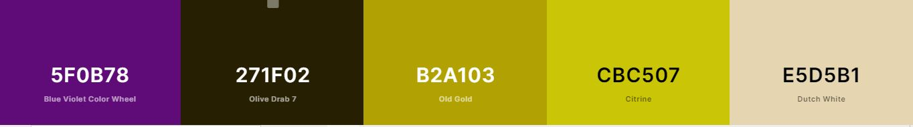

<h1 align="center">Code Institute Milestone Project 2 - Brands Memory Game</h1>

Click [here](#) to see live project.

# Brands Memory Game

Aim of this project is to create a memory game using standard HTML and CSS structure, and by adding JS interactive features.

# Table of Content

1. [User experience](#user-experience)
    - [User Stories](#user-stories)
    - [Design](#design)
    - [Wireframe](#wireframe)
2. [Features](#features)
    - [Existing Features](#existing-features)
    - [Features left to Implement](#features-left-to-implement)
3. [Technologies Used](#technologies-used)
    - [Technologies](#technologies)
    - [Languages](#languages)
    - [Frameworks](#frameworks)
    - [Libraries](#libraries)
    - [Other](#other)
4. [Testing](#testing)
5. [Bugs](#bugs)
6. [Deployment](#deployment)
7. [Credits](#credits)

# User Experience

## User Stories

- ### First Time Visitor Goals
    1. As a First Time Visitor, I want to be able to navigate the website with ease.
    2. As a First Time Visitor, I want to be able to find out how the game works.
    3. As a First Time Visitor, I want to be able to play the game.
    4. As a First Time Visitor, I want to be able to find out what my score is at the end of the game.

- ### Returning Visitor Goals
    1. As a Returning Visitor, I want to play the game and get better at it.
    2. As a Returning Visitor, I want to be able to beat my own time.
    3. As a Returning Visitor, I want to be able to beat my own score.

## Design

When choosing elements for this project, I decided to keep it eye catchy.
The colors and the music theme were chosen to brighten up the day of any user.

### Tune

- The reggae music theme was selected to make playing the game a positive experience.

- Free tune was taken from [Stockmusic](https://stockmusic.net/) website.

### Colour

- Colour palette used for this project was taken from [Coolors Website](https://coolors.co).

- Main colors used in the project are Violet (#5F0B78), Olive (#271F02), Gold (#B2A103), Citrine (#CBC507) and Dutch White (#E5D5B1).

- Colors picked for this project were selected to make the project eye catchy.

- The selected pallete can be viewed [here](https://coolors.co/5f0b78-271f02-b2a103-cbc507-e5d5b1)

### Typography

- [Font](https://fonts.google.com/) Indie Flower was used throughout the project.

- [Fontawesome](https://fontawesome.com/) icon was used for the icons of the memory game as well as for the Github link within the project.

## Wireframe

- Wireframe was developed using [Figma](https://www.figma.com/).

- Files saved from Figma, were converted from .fig into .jpg file with use of [Filestar](https://filestar.com/) application.

- Wireframe of this application can be seen in the documentation folder in this project in .jpg file.

[Top](#table-of-content)
# Features

This application allows users to easy navigate between the game and all it's features:

## Existing Features

- **Instructions** - the home page of the project displays game instructions to a user.

- **Play** - function available from the home page, allowing user to beging the game.

- **Play Music** - Tune starts playing when the page is first open. Controls panel allows user to turn the music on or off, to pause the music and even download the track.

- **Github** - link that allows user to access my Github repository and find my other projects.

- **Score** - simple count of points achived in the game.

- **Moves** - simple count of clicks in the game.

- **Time** - timer showing the amount of time spent playing the game.

## Features Left to Implement

- **Leaderboard** - feature will be added, allowing users to keep track of the overall score achived in this game.

- **Invite friend** - feature will be added, allowing user to invite friends to play the game.

[Top](#table-of-content)
# Technologies Used

## Technologies

- [Figma](https://www.figma.com/)
    - to provide wireframe.

- [Filestar](https://filestar.com/)
    - to convert the wireframe file from .fig to .jpg.

- [Fontawesome](https://fontawesome.com/)
    - to provide icons to the game.

- [Google Fonts](https://fonts.google.com/)
    - to provide free font to the app.

- [Freeformatter](https://www.freeformatter.com/html-formatter.html)
    - to beautify the HTML code.

- [W3C Validator](https://validator.w3.org/nu/#textarea)
    - to validate HTML code.

- [Jigsaw W3C Validator](https://jigsaw.w3.org/css-validator/validator)
    - to validate CSS code by input.

- [Am I responsive](http://ami.responsivedesign.is/#)
    - to test mobile devices responsiveness of my website.

- [Techsini](https://techsini.com/multi-mockup/)
    - to create this project mockup, of which image is placed at the very top of this readme file.
    
[Top](#table-of-content)

